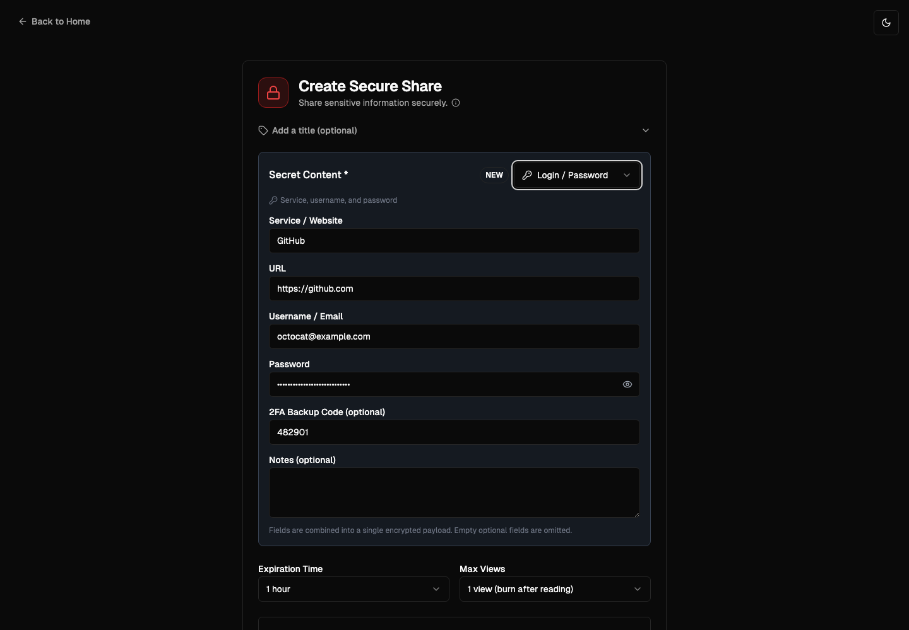
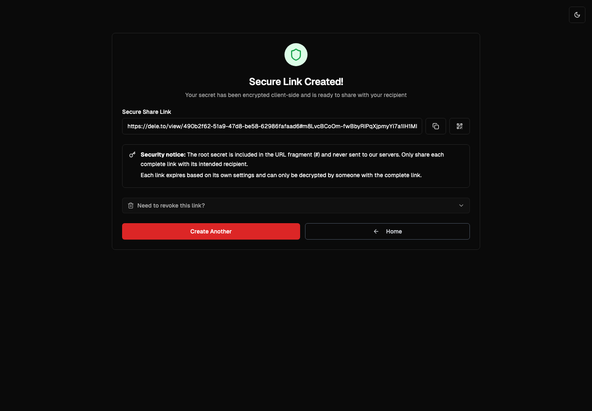
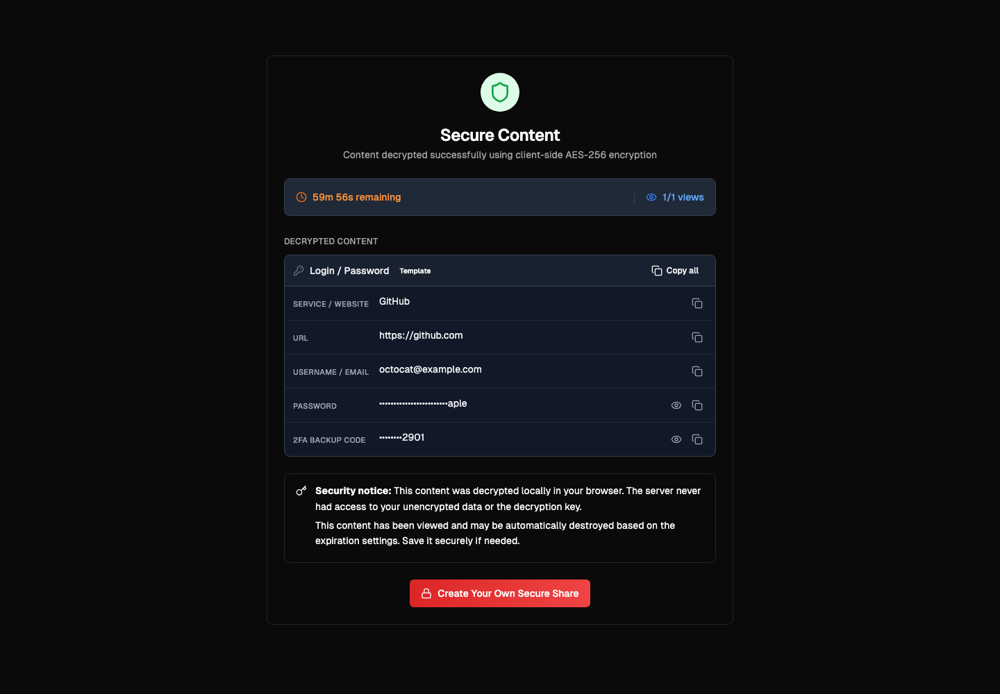
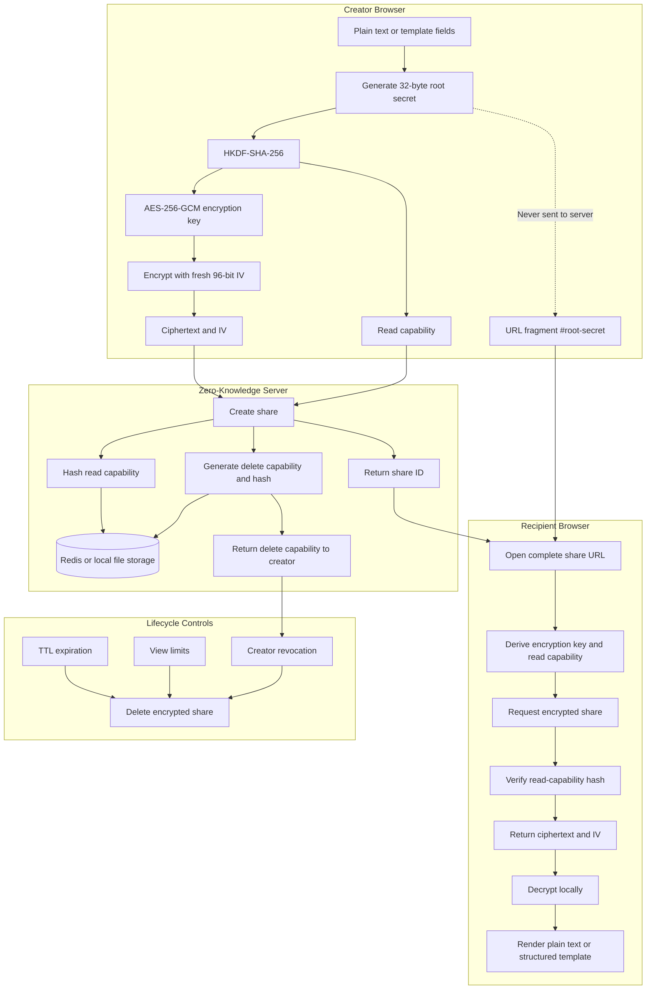

# DELE.TO 🔥 [![License: MIT][license-badge]][license] [![Buy me a Coffee][buy-me-a-coffee-badge]][buy-me-a-coffee]
<a href="https://www.producthunt.com/products/deleto?embed=true&utm_source=badge-featured&utm_medium=badge&utm_source=badge-deleto" target="_blank"></a>

[license]: https://opensource.org/licenses/MIT
[license-badge]: https://img.shields.io/badge/License-MIT-blue.svg
[buy-me-a-coffee-badge]: https://img.shields.io/badge/Buy_Me_A_Coffee-FFDD00?style=flat&logo=buy-me-a-coffee&logoColor=black
[buy-me-a-coffee]: https://www.buymeacoffee.com/arddluma

*From Latin dēlētō — "erase, destroy."*

**Secure credential sharing with client-side AES-256-GCM encryption, capability-protected links, and automatic self-destruction.
Alternative to PasswordPusher, Yopass, and Bitwarden Send.**

DELE.TO is a zero-knowledge platform for sharing passwords, API keys, credentials, and structured secrets. Each share is encrypted in the browser before it reaches the server. A root secret stays in the URL fragment and is used to derive separate encryption and read-capability values with HKDF-SHA-256.

🔗 https://dele.to — Try it instantly in your browser. No signup required.

## 📋 Table of Contents

- [✨ Features](#-features)
- [📸 Screenshots](#-screenshots)
- [🚀 Quick Start](#-quick-start)
- [🏗️ Architecture Overview](#️-architecture-overview)
- [🔐 Encryption & Decryption Process](#-encryption--decryption-process)
- [🔄 Data Flow Example](#data-flow-example)
- [🧪 Testing](#-testing)
- [🛠️ Tech Stack](#️-tech-stack)
- [📁 Project Structure](#-project-structure)
- [🧰 Development Tips](#-development-tips)
- [🤝 Contributing](#-contributing)

## ✨ Features

- **Client-side AES-256-GCM encryption** - Secret content never leaves the browser in plaintext
- **HKDF-derived share secrets** - One root secret derives separate encryption and read-capability values
- **Capability-protected access** - The server stores capability hashes instead of plaintext capabilities
- **Share revocation** - Creators can permanently revoke a generated link
- **Structured secret templates** - Login, credit card, API key, SSH key, Wi-Fi, bank, wallet, secure note, and plain text
- **Per-recipient encryption** - Multi-recipient shares receive independently encrypted links
- **Automatic expiration and view limits** - Includes burn-after-reading behavior
- **Optional password protection** - Adds another access-control layer
- **QR code sharing** - Open generated links on another device
- **Redis or local storage** - Encrypted payloads use TTL cleanup with a development fallback
- **Responsive dark-mode interface** - Works across desktop and mobile devices

## 📸 Screenshots

<div style="display: flex; overflow-x: auto; white-space: nowrap; padding-bottom: 20px;">
  
  
  
</div>


## 🚀 Quick Start

### Prerequisites

- **Node.js 20+** - [Download here](https://nodejs.org/)
- **pnpm 9** - Enable the pinned package manager with `corepack enable`
- **Git** - For cloning the repository

**Optional for Production:**
- **Redis** - For production scaling (uses local file storage by default)

### Step-by-Step Setup

#### 1. Clone and Navigate
```bash
git clone https://github.com/dele-to/dele-to.git
cd dele-to
```

#### 2. Install Dependencies
```bash
# Using pnpm (recommended)
pnpm install

# Or using npm
npm install

# Or using yarn
yarn install
```

#### 3. Environment Configuration (Optional for Development)

**For Development:** No configuration needed! The app works out of the box using local file storage.

**For Production:** 


[](https://vercel.com/new/clone?repository-url=https%3A%2F%2Fgithub.com%2Fdele-to%2Fdele-to)

Create your environment file for Redis storage:
```bash
cp .env.example .env
```

Edit `.env` with your configuration:
```env
# Redis Configuration (Required for production)
KV_REST_API_URL=your_redis_url_here
KV_REST_API_TOKEN=your_redis_token_here

# Security Salt (Change this in production!)
SALT=your-super-secret-salt-change-me-in-production

```

> **💡 Development Note:** The app automatically uses local file storage (`./.secure-shares/` directory) when Redis is not configured, making it perfect for development and testing without any setup.

#### 4. Start Development Server
```bash
pnpm dev
```

The app will be available at **http://localhost:3000**

#### 5. Test the Application
1. Open http://localhost:3000 in your browser
2. Click "Create a secret"
3. Choose a template or enter plain text, then create the share
4. Open the generated link and verify client-side decryption
5. Return to the creation result and test revoking the link

### Running with Docker

#### Manual Setup (without Redis - local file storage)

```bash
docker build -t dele-to .
## This persists the shares data to your host machine (as Redis is not used)
docker run -p 3000:3000 -v "$(pwd)/.secure-shares:/app/.secure-shares" --name dele-to dele-to
```
#### To run with Redis (recommended for production):

```bash
docker compose up --build -d
```

The application will be available at **http://localhost:3000**.

## 🏗️ Architecture Overview

<details>
<summary><strong>🏗️ Architecture Overview</strong> (Click to expand)</summary>

DELE.TO uses a zero-knowledge architecture where encryption happens entirely client-side:

<details>
<summary><strong>📊 System Architecture Diagram</strong> (Click to expand)</summary>



</details>


</details>

## 🔐 Encryption & Decryption Process

<details>
<summary><strong>🔐 Encryption & Decryption Process</strong> (Click to expand)</summary>

### 1) Generate and derive share secrets in the browser

```js
const rootSecret = crypto.getRandomValues(new Uint8Array(32))
const rootKey = await crypto.subtle.importKey(
  "raw",
  rootSecret,
  "HKDF",
  false,
  ["deriveKey", "deriveBits"],
)

const encryptionKey = await crypto.subtle.deriveKey(
  {
    name: "HKDF",
    hash: "SHA-256",
    salt: new TextEncoder().encode("deleto:share:v1"),
    info: new TextEncoder().encode("encryption"),
  },
  rootKey,
  { name: "AES-GCM", length: 256 },
  false,
  ["encrypt", "decrypt"],
)
```

The same root secret derives a separate 256-bit read capability with the HKDF info value `read-capability`. The root secret and encryption key never leave the browser.

### 2) Encrypt the payload

```js
const iv = crypto.getRandomValues(new Uint8Array(12))
const encrypted = await crypto.subtle.encrypt(
  { name: "AES-GCM", iv },
  encryptionKey,
  new TextEncoder().encode(plaintext),
)
```

AES-256-GCM provides authenticated encryption. Each recipient-specific share uses a fresh root secret, derived encryption key, and IV.

### 3) Create the protected share

The browser sends the ciphertext, IV, metadata, and derived read capability. The server hashes the capability before storage, generates a separate delete capability, and returns the share ID plus the creator-only delete capability.

The complete URL has this form:

```text
https://dele.to/view/<share-id>#<root-secret>
```

Browsers do not include URL fragments in HTTP requests, so the root secret is not sent to the server.

### 4) Access and decrypt in the recipient browser

The recipient browser extracts and immediately removes the fragment, derives the same encryption key and read capability, and sends only the read capability when requesting the encrypted share. After the server verifies its hash, decryption happens locally.

### Stored share data

- `encryptedContent`: Base64 ciphertext, unusable without the derived encryption key.
- `iv`: Base64 12-byte IV, safe to store alongside ciphertext.
- `readCapabilityHash`: SHA-256 hash used to authorize metadata and content access.
- `deleteCapabilityHash`: SHA-256 hash used to authorize creator revocation.
- Expiration, view limits, password settings, title, and creation metadata.

</details>

## Data Flow Example

<details>
<summary><strong>Data Flow Example</strong> (Click to expand)</summary>
Consider a login template containing a service, username, and password.

**Step 1: Serialize the template locally**

```text
[Login / Password]
Service / Website: GitHub
Username / Email: octocat@example.com
Password: correct-horse-battery-staple
```

**Step 2: Generate one root secret and derive two independent values**

```text
root secret --HKDF(encryption)------> AES-256-GCM key
            --HKDF(read-capability)-> read capability
```

**Step 3: Encrypt before transmission**

```text
plaintext + derived key + random IV -> authenticated ciphertext
```

**Step 4: Send only protected data to the server**

```json
{
  "encryptedContent": "<base64-ciphertext>",
  "iv": "<base64-iv>",
  "readCapability": "<derived-capability>",
  "expirationTime": "1h",
  "maxViews": 1,
  "requirePassword": false,
  "linkType": "standard"
}
```

The server stores SHA-256 hashes of the read and delete capabilities alongside the encrypted payload.

**Step 5: Build the complete share URL**

```text
https://dele.to/view/abc123#<root-secret>
```

Only the recipient's browser receives the root secret. The server receives a derived read capability when access is requested, verifies its hash, and returns the encrypted payload.

**Step 6: Revoke when necessary**

The creator can use the separately returned delete capability from the creation result to permanently remove the encrypted share before it expires.

</details>


## 🧪 Testing


```bash
# Run all tests
pnpm test

# Generate coverage report
pnpm test:coverage

# Test capability and encryption behavior
pnpm test -- --runInBand __tests__/crypto.test.ts __tests__/share-simple.test.ts
```

The capability tests cover HKDF derivation, hashed read/delete capabilities, unauthorized access, explicit revocation, and legacy-share compatibility.

**📊 For detailed test status and coverage reports, see [TEST_STATUS.md](TEST_STATUS.md)**

### Storage Options

#### File Storage (Development Default)
- **✅ No setup required** - works out of the box
- **📁 Location**: `./.secure-shares/` directory (auto-created)
- **🎯 Perfect for**: Development, testing, and local demos
- **⚠️ Limitations**: Not suitable for production scaling or multiple servers

#### Redis Storage (Production Recommended)
- **🔧 Setup**: Add Redis URL and token to `.env` or Vercel environment variables
- **☁️ Provider**: [Upstash](https://upstash.com/) (free tier available)
- **🚀 Benefits**: Automatic TTL, better performance, horizontally scalable

### 🧰 Development Tips

<details>
<summary><strong>🧰 Development Tips</strong> (Click to expand)</summary>

1. **Hot Reload**: Changes to code automatically refresh the browser
2. **TypeScript**: Full TypeScript support with type checking
3. **Tailwind**: Use Tailwind classes for styling
4. **Components**: UI components are in `components/ui/`
5. **Crypto**: Encryption logic is in `lib/crypto.ts`

---

#### Troubleshooting

• Module Not Found Errors
```bash
# Clear node_modules and reinstall
rm -rf node_modules package-lock.json
pnpm install
```

• Build Errors
```bash
# Clear Next.js cache
rm -rf .next
pnpm build
```

</details>

## 🛠️ Tech Stack

- **Framework**: Next.js 14 (App Router)
- **Language**: TypeScript
- **Styling**: Tailwind CSS
- **UI Components**: Radix UI + shadcn/ui
- **Database**: Redis (Upstash) with file system fallback
- **Encryption**: Web Crypto API (HKDF-SHA-256 + AES-256-GCM)
- **Icons**: Lucide React
- **Fonts**: Geist Sans & Geist Mono

## 📁 Project Structure

<details>
<summary><strong>📁 Project Structure</strong> (Click to expand)</summary>

```
dele-to/
├── __tests__/                 # Jest tests
│   ├── crypto.test.ts
│   └── share-simple.test.ts
├── app/                       # Next.js app directory
│   ├── about/
│   ├── actions/
│   ├── alternatives/
│   ├── create/
│   ├── frame/
│   ├── miniapp/
│   ├── view/[id]/
│   ├── vs/
│   ├── globals.css
│   ├── icon.png
│   ├── layout.tsx
│   ├── not-found.tsx
│   └── page.tsx
├── components/                # React components
│   ├── ui/                    # shadcn/ui components
│   ├── access-tips.tsx
│   ├── console-message.tsx
│   ├── farcaster-debug.tsx
│   ├── farcaster-provider.tsx
│   ├── farcaster-ready.tsx
│   ├── footer.tsx
│   ├── inline-tip.tsx
│   ├── password-input.tsx
│   ├── secret-templates.tsx
│   ├── security-tips.tsx
│   └── theme-provider.tsx
├── hooks/
│   ├── use-farcaster.ts
│   ├── use-mobile.tsx
│   └── use-toast.ts
├── lib/                       # Utility libraries
│   ├── crypto.ts              # HKDF and encryption utilities
│   ├── farcaster.ts
│   ├── share-storage.ts       # Redis and local storage primitives
│   └── utils.ts
├── public/                    # Static assets
│   ├── .well-known/
│   │   └── farcaster.json
│   ├── favicon.ico
│   ├── favicon.png
│   └── SEO.png
├── styles/
│   └── globals.css
├── README.md
├── package.json
└── tailwind.config.ts
```

</details>

<!-- Removed trailing Security Features section (duplicate content) -->

## 🤝 Contributing

We welcome contributions! Here's how to get started:

### Development Setup

1. **Fork the repository** on GitHub
2. **Clone your fork** locally
3. **Create a feature branch**
   ```bash
   git checkout -b feature/amazing-feature
   ```
4. **Make your changes** and test thoroughly
5. **Commit with conventional commits**
   ```bash
   git commit -m "feat: add amazing feature"
   ```
6. **Push to your fork**
   ```bash
   git push origin feature/amazing-feature
   ```
7. **Open a Pull Request**


## 📄 License

This project is licensed under the MIT License - see the [LICENSE](LICENSE) file for details.

## 🙏 Acknowledgments

- [Next.js](https://nextjs.org/) - The React framework
- [Tailwind CSS](https://tailwindcss.com/) - Utility-first CSS
- [Radix UI](https://www.radix-ui.com/) - Accessible components
- [Lucide](https://lucide.dev/) - Beautiful icons
- [Upstash](https://upstash.com/) - Serverless Redis

## 📞 Support

- 📧 **Email**: support@dele.to
- 🐛 **Issues**: [GitHub Issues](https://github.com/dele-to/dele-to/issues)
- 💬 **Discussions**: [GitHub Discussions](https://github.com/dele-to/dele-to/discussions)

---
